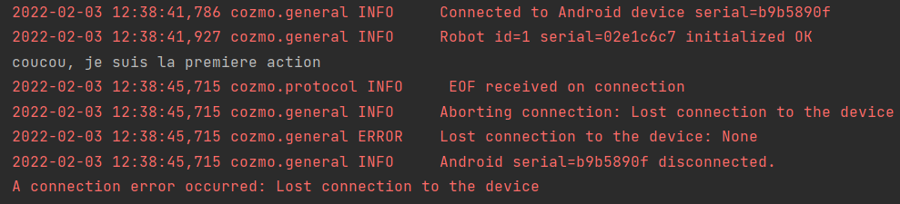

# Soucis pour la connexion ADB
>
> Pour pouvoir se connecter à Cozmo, il faut activer le mode développeur de son téléphone, et le debogage par USB.
> Ainsi, lorsque l'on connecte à l'ordinateur possédant le code python, une pop-up est affichée, nous demandans si l'on authorise le debogage USB via cet ordinateur.
> 
> Sous android 8, avec la surcouche de XX, aucuns soucis n'est à déplorer.
> En revanche sous Android 11, avec la surcouche MIUI 12.5.7 (stable), certaines fonctions du SDK Cozmo ne fonctionnent pas, tel
> [cozmo.robot.SayText](http://cozmosdk.anki.com/docs/generated/cozmo.robot.html#cozmo.robot.SayText).
> Cela provoque .

> Cependant, en testant avec un autre mobile, sous Android 11, avec la surcouche de OnePlus, avec le même cable et ordinateur, ces fonctions marchent.
>
